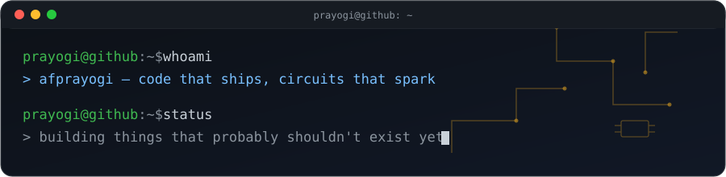

<picture>
  <source media="(prefers-color-scheme: dark)" srcset="assets/banner-dark.svg">
  <source media="(prefers-color-scheme: light)" srcset="assets/banner-light.svg">
  
</picture>

not a "full-stack developer." not a "tech enthusiast." just someone who breaks
programs and circuits on purpose to see how they come back together.

```
$ cat manifesto.txt
```

- i don't collect frameworks, i collect problems worth solving
- if it has a README full of badges and no working code, i'm skeptical
- software should touch hardware eventually, or what's the point
- indonesian by default, engineer by choice, loud on neither

```
$ ls ~/stack --group-directories-first
```

| domain             | tools                                      |
|--------------------|---------------------------------------------|
| daily driver       | python, typescript                          |
| also fluent in     | html/css, dart, c#                          |
| currently digging  | reinforcement learning, edge ai, embedded   |
| not interested in  | trend-chasing, "10x developer" threads      |

```
$ ls ~/projects --sort=recent -la
```

<!--START_PROJECTS-->
- [learningneuralnetworkonmikrokontroler](https://github.com/afprayogi/learningneuralnetworkonmikrokontroler) — project belajar · `python`
- [ModbusMeter-Suite](https://github.com/afprayogi/ModbusMeter-Suite) — Modbus power-meter logging & live monitoring for Windows — installable software, zero Python required · `python`
- [goleklomba_buatanclaude](https://github.com/afprayogi/goleklomba_buatanclaude) — scrapping compettion on browser and i am make this with my claude services · `html`
- [ai-internship-search-proto](https://github.com/afprayogi/ai-internship-search-proto) — AI-powered internship search assistant for Indonesian engineering students — Claude Code workflow for profile setup, job evaluation, tailored CV/cover letters, and interview prep, plus an offline LinkedIn/JobStreet scraper with WhatsApp notifications. · `typescript`
- [maze-rl-lab](https://github.com/afprayogi/maze-rl-lab) — Tabular RL agents (Q-learning, SARSA, Double Q-learning) that learn to escape auto-generated mazes using only 4 relative wall sensors — no coordinates, no map. Includes multi-seed statistics, generalization testing, and an adversarial maze generator. · `python`
<!--END_PROJECTS-->

```
$ tail -f contact.log
```

no discord badge wall, no "let's connect 🚀" — just [github.com/afprayogi](https://github.com/afprayogi)

---

<!--LAST_UPDATED-->
`last sync: 2026-09-07 01:23 UTC` — kept honest by [update.py](update.py), not by hand
<!--END_LAST_UPDATED-->
